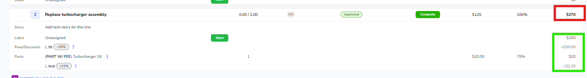

# SV-8480 — Fees/Discounts do not sum on the line total (Ingest / Requirements)

> **Source (pointer only — Atlassian-SSO login-walled, do NOT fetch):**
> https://shopview.atlassian.net/browse/SV-8480
> Content below was ingested ENTIRELY from already-downloaded local capture at
> `/tmp/fd-tickets/SV-8480/` (issue.json, comments, description, attachments). No Jira
> login/network used.

## Ticket metadata

| Field | Value |
|---|---|
| **Ingest date** | 2026-07-22 |
| **Key** | SV-8480 |
| **Summary** | Fees/Discounts do not sum on the line total, causing confusion when the line is collapsed |
| **Project** | ShopView (SV) |
| **Epic** | SV-7387 (Fees & Discounts V1) |
| **Parent (Story)** | SV-8279 — "Story 3: Viewing and managing fees & discounts on the work order" |
| **PO** | Chris Ward |
| **Issue type** | Story Defect (sub-task) |
| **Status** | **Done** (resolution: Done) |
| **Priority** | Medium |
| **Reporter** | Chris Ward |
| **Creator** | Chris Ward |
| **Assignee** | Stefan Vukovic |
| **Labels** | QAcomplete_Ahtasham_Amjad, Staging_Verified, fees-discounts |
| **Created** | 2026-07-21 22:09 (-0500) |
| **Resolved** | 2026-07-22 04:59 (-0500) |
| **Related** | SV-8456 (Done) & SV-8479 (Rejected from testing) — cosmetic UI corrections; **this ticket is a separate calculation defect** |

---

## DESCRIPTION (verbatim)

**PRODUCT AREA**
Work Orders / Fees & Discounts

**ENVIRONMENT**
Staging — found during Demo Day. Calculation-correctness defect: the rolled-up line total is wrong, so this may be a frontend rollup issue and/or a backend line-total calculation issue — confirm which during triage. Separate from SV-8456 (Done) / SV-8479 (REJECTED FROM TESTING), which are cosmetic.

**DESCRIPTION**
On a work order line, the line total does not include the line's own fees and discounts. It sums Labor + Parts only and ignores the labor-line and part-line fees/discounts, so the displayed line total is understated.

**STEPS TO REPRODUCE**

1. Open a Work Order → Lines tab.
2. On a line, add a labor-line fee/discount and a part-line fee/discount (percentage or flat).
3. Compare the line's Total (top-right of the line row) against the sum of: Labor + labor fees/discounts + Parts + part fees/discounts.

**ACTUAL RESULT**
The line Total ignores the line-level fees/discounts. In the pictured line "Replace turbocharger assembly":

* Labor: $250.00
* Labor fee "ttt" +20%: +$50.00
* Part "Turbocharger Oil": $20.00
* Part fee "test" +11%: +$2.20
* Line Total shown: $270.00 (= Labor $250 + Part $20 only; both fees omitted).
(Picture 1: red = the wrong $270 total; green = the components being ignored.)

**EXPECTED RESULT**
The line Total includes all line-level fees and discounts:
Labor $250.00 + labor fee $50.00 + Part $20.00 + part fee $2.20 = $322.20.
So the pictured line (red) should show a Total of $322.20.

---

## COMMENTS (all, in order — verbatim)

### 1. Stefan Vukovic — 2026-07-22 13:35 (-0500)

**Fixed — merged to develop (staging).** PR: https://github.com/ShopView/shopview/pull/2228

Root cause was backend: the per-line `total_cost` summed Labor + Parts gross only and ignored the line's own fees/discounts. It now adds those signed amounts on top (the same values shown in the rows beneath), per spec **S3-R18**. Display-only — no stored values change.

**QA steps:**

1. On a WO line, add a labor-line fee/discount and a part-line fee/discount (% or flat) → collapsed line Total = Labor + Parts + all that line's fee/discount amounts (the ticket example now shows **$322.20**, not $270.00). Discounts subtract.
2. Line with no fees/discounts → Total unchanged.
3. Estimate/invoice documents: labor row stays gross, fees print as their own rows — grand total unchanged (no double-count).
4. Org without the Fees & Discounts feature flag → line totals unchanged (gross-only).

### 2. Ahtasham Amjad — 2026-07-22 14:59 (-0500)

**QA Result:**

**Env:** Staging

Stefan Vukovic
This is verified on staging, working as expected

[8480-staging fixed.webm] (attached)

**QA Status:** **Passed**

cc: Chris Ward

---

## ATTACHMENTS (2 — complete set per Rule 17)

| # | Filename | Type | Size | Author | Created | In repo? |
|---|---|---|---|---|---|---|
| 1 | image-20260722-031940.png | image/png | 27 kB (27,512 bytes) | Chris Ward | 2026-07-21 22:19 (-0500) | **YES** — `attachments/SV-8480/image-20260722-031940.png` (app-UI screenshot) |
| 2 | 8480-staging fixed.webm | video/webm | 20.56 MB (21,556,900 bytes) | Ahtasham Amjad | 2026-07-22 14:59 (-0500) | **NO** — referenced from `/tmp/fd-tickets/SV-8480/att/58837.webm` (see note) |

### Attachment 1 — image-20260722-031940.png (ANALYZED)

App-UI screenshot of the Work Order **Lines** tab, line row #2 **"Replace turbocharger assembly"** (status Approved, **Complete**), captured by the reporter to evidence the bug. Exact figures shown on screen:

**Collapsed line header row (line 2):**
- Progress: `0.00 / 2.00`, `0%`
- Badges: `Approved`, `Complete`
- Rate column: `$125`
- `100%`
- **Line Total (top-right, boxed in RED = the WRONG value): `$270`**

**Expanded detail rows beneath (all boxed in GREEN = the components being ignored by the total):**
- **Labor** — Unassigned — amount **`$250`**
- **Fees/Discounts** — `↳ ttt` `+20%` — amount **`+$50.00`**
- **Parts** — `(PART W/ FEE) Turbocharger Oil`, qty `1`, unit `$20.00`, `75%` — amount **`$20`**
- `↳ test` `+11%` — amount **`+$2.20`**

So the screenshot proves: collapsed Total `$270` = Labor `$250` + Part `$20` only; the labor fee `+$50.00` and the part fee `+$2.20` (green) are excluded. Correct value should be `$250 + $50.00 + $20 + $2.20 = $322.20`. (Red box = wrong total; green boxes = the omitted fee amounts.) A "SHOPGRAPH LINE BUILDER" element is partially visible at the bottom of the capture.

### Attachment 2 — 8480-staging fixed.webm (NOT analyzed — see note)

- **ffmpeg / ffprobe / mplayer / mpv / vlc are NOT available in this environment**, so frames could NOT be extracted and the video could NOT be analyzed here. It **must be reviewed manually** at `/tmp/fd-tickets/SV-8480/att/58837.webm` (20.56 MB).
- Provenance (from ticket): posted by QA (Ahtasham Amjad) with the QA-Passed comment as the **post-fix staging verification** recording — filename literally "8480-staging fixed.webm". Per Stefan's QA steps + Ahtasham's comment, it demonstrates the fixed staging build where the collapsed line Total now reads **$322.20** (not $270.00) for the pictured example, verified working as expected.
- **Not copied into the repo** due to size (20.56 MB); referenced from `/tmp`. It contains app-UI only (no credentials), so it may be copied later if a smaller/app-only clip is needed.

---

## SCOPE HEADLINE (plain terms)

**The bug:** On a Work Order line, the collapsed **line Total** (shown top-right of the line row) left out that line's own fees and discounts. It added up only **Labor + Parts (gross)** and ignored the labor-line fee/discount and the part-line fee/discount, so the total shown was too low. In the example line "Replace turbocharger assembly" it showed **$270.00** when it should have shown **$322.20** — the +$50.00 labor fee and the +$2.20 part fee were both dropped.

**The calculation rule that must hold (acceptance criteria):**

1. **Line Total = Labor (gross) + Parts (gross) + every one of that line's own fee/discount amounts (signed).** Fees add; discounts subtract. The fee/discount amounts used are exactly the ones displayed in the rows beneath the line (e.g. labor fee `+$50.00`, part fee `+$2.20`). For the ticket example: `$250.00 + $50.00 + $20.00 + $2.20 = $322.20`, and the collapsed line Total must read **$322.20**, not $270.00.
2. **Line with no fees/discounts → line Total unchanged** (same as before the fix; gross Labor + Parts).
3. **Estimate / invoice documents are unaffected:** the labor row still prints gross and each fee prints as its own separate row; the document **grand total is unchanged** (no double-counting the fees).
4. **Feature-flag gating:** for an org **without** the Fees & Discounts feature flag, line totals are **unchanged (gross-only)** — the new fee/discount roll-in only applies when the feature is on.

**Fix location & nature (from dev comment):** Backend fix in the per-line `total_cost` computation (previously summed Labor + Parts gross only; now adds the line's signed fee/discount amounts on top), per spec **S3-R18**. It is **display-only — no stored values change**. Delivered in PR ShopView/shopview#2228, merged to develop (staging).

**Traceability (Rule 20):** Ticket **SV-8480** (Story Defect under Story **SV-8279**, Epic **SV-7387**); spec anchor **S3-R18** (line-total = Labor + Parts + line-level fee/discount amounts, signed). Status **Done**, QA-verified Passed on staging 2026-07-22.
